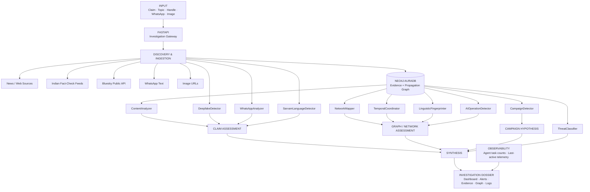

# ECHOSNARE

### Evidence-first graph intelligence for investigating coordinated online narratives

**ECHOSNARE** is an analyst-facing investigation system that connects two things that are usually treated separately:

> **What does the available evidence say about a claim?**  
> **How is that claim moving through the network?**

Instead of stopping at a post-level "fake / real" prediction, ECHOSNARE builds a traceable investigation around a narrative: it retrieves source material, extracts the claim, models accounts/posts/campaigns as a graph, detects temporal and structural coordination, profiles suspicious propagation behaviour, and produces an explainable threat assessment with provenance and execution telemetry.

**Core idea:**

```text
Claim
  ↓
Evidence + Entities + Propagation
  ↓
Graph
  ↓
Forensic Signals
  ↓
Claim Assessment + Network Assessment
  ↓
Traceable Investigation Dossier
```

---

## Why ECHOSNARE exists

Online misinformation is not only a content problem. A false or misleading narrative can be amplified by many accounts, repeated across communities, synchronized in time, rewritten through multiple linguistic styles, or combined with manipulated media.

Traditional pipelines often answer:

```text
"Does this post look suspicious?"
```

ECHOSNARE asks a larger question:

```text
"What is the claim, what evidence exists around it,
who is propagating it, how are they connected,
and does the resulting structure resemble coordinated amplification?"
```

That shift—from isolated classification to **evidence + infrastructure analysis**—is the foundation of the system.

---

## What ECHOSNARE produces

A single investigation can produce:

| Layer | Output |
|---|---|
| **Claim** | Extracted narrative / claim under investigation |
| **Evidence** | Retrieved sources and their relationship to the claim |
| **Propagation** | Accounts, posts, interactions and campaign membership |
| **Coordination** | Temporal synchronization, density and connected clusters |
| **Account Intelligence** | Behavioural and graph-derived risk signals |
| **Language Intelligence** | Hindi / Hinglish / Indian-language identification |
| **Media Forensics** | ELA, EXIF and AI-image corroboration |
| **Threat Assessment** | Campaign / coordination classification and severity |
| **Observability** | Per-agent execution counts and last-active telemetry |

ECHOSNARE deliberately keeps **claim status**, **evidence confidence**, **network risk**, and **system reliability** as separate concepts. A highly coordinated network is not automatically proof that its claim is false, and absence of evidence is not treated as proof of falsity.

---

# System Architecture



---

# The investigation flow

## 1. Intake

ECHOSNARE accepts an investigative input such as:

- a text claim or narrative
- a WhatsApp forward
- a social handle
- an image URL
- a campaign / topic payload

The system first determines what kind of investigation is being requested instead of forcing every input through the same detector.

## 2. Discovery and evidence retrieval

The evidence layer retrieves external material from supported channels such as news feeds, fact-checking feeds and public social data.

Retrieved material is treated as **evidence**, not as unquestionable truth. The investigation keeps source availability and provenance explicit so analysts can distinguish:

```text
SOURCE FOUND
SOURCE RELEVANT
SOURCE SUPPORTS
SOURCE CONTRADICTS
SOURCE PROVIDES CONTEXT
SOURCE UNAVAILABLE
```

## 3. Entity and claim extraction

The system identifies the main claim, relevant accounts, posts, campaign context, language signals, red flags and other entities needed for downstream analysis.

## 4. Graph construction

Accounts, posts and campaigns are represented as graph entities in Neo4j.

```text
(Account)-[:SHARED]->(Post)
(Account)-[:PART_OF]->(Campaign)
(Post)-[:PART_OF]->(Campaign)
(Account)-[:INTERACTS]->(Account)
(Account)-[:COORDINATES_WITH]->(Account)
```

The important design choice is that **coordination is represented as a relationship**, not as a note attached to an account.

## 5. Forensic analysis

The graph and the content are then analysed through several independent lenses:

```text
Temporal
  ↓
Who posted within the same short time window?

Linguistic
  ↓
Which accounts exhibit similar writing fingerprints?

Behavioral
  ↓
Which accounts show unusual account / activity patterns?

Structural
  ↓
Which nodes are central, bridging, or highly connected?

Community
  ↓
Which accounts form coherent propagation clusters?

Media / Language
  ↓
Is the attached media manipulated, AI-generated, or language-specific?
```

## 6. Campaign assessment

The campaign layer fuses content risk, narrative similarity and graph behaviour to decide whether the observed activity is better described as isolated misinformation or coordinated propagation.

## 7. Threat synthesis

The threat layer converts the accumulated findings into a structured classification and explanation. LLM reasoning is used selectively; deterministic and statistical methods remain responsible for most graph and forensic calculations.

## 8. Dossier + telemetry

The dashboard presents the graph, evidence, findings, alerts and agent activity together so an analyst can inspect not only the result, but also **how the result was produced**.

---

# The graph model

The graph is the core analytical substrate.

### Nodes

| Node | Meaning |
|---|---|
| `Account` | A social account / actor involved in propagation |
| `Post` | A concrete piece of published content |
| `Campaign` | A narrative or coordinated activity grouping |

### Relationships

| Relationship | Meaning |
|---|---|
| `SHARED` | Account authored/shared a post |
| `PART_OF` | Account or post belongs to a campaign |
| `INTERACTS` | Observable account-to-account interaction |
| `COORDINATES_WITH` | Temporal / propagation evidence suggests coordinated behaviour |

### The load-bearing relationship

`COORDINATES_WITH` is the key graph primitive for synchronized amplification.

When posts from different accounts fall within the configured coordination window, the relationship can be materialized with a timing attribute such as:

```text
A ──COORDINATES_WITH { delay_seconds: 18 }──> B
```

This turns raw temporal observations into traversable graph structure.

Instead of repeatedly asking:

```text
"Which other posts were close to this timestamp?"
```

the graph can answer relationship-oriented questions through traversal and graph analysis.

---

# Graph intelligence: Neo4j + NetworkX

ECHOSNARE uses **Neo4j AuraDB as the primary persistent graph layer**.

For analytical fallback paths, the system can construct an in-memory **NetworkX** graph from campaign nodes and edges.

### NetworkX analytical path

```text
Campaign payload
      ↓
nx.Graph()
      ↓
PageRank
Betweenness Centrality
Clustering Coefficient
      ↓
Community Detection
      ↓
Density + Bot Signals
      ↓
NetworkAnalysisResult
```

### What the metrics mean

| Metric | Question it answers |
|---|---|
| **PageRank** | Which nodes are structurally influential? |
| **Betweenness Centrality** | Which nodes act as bridges between network regions? |
| **Clustering Coefficient** | How interconnected is a node's local neighbourhood? |
| **Density** | How tightly connected is the graph overall? |
| **Community Detection** | Which accounts form coherent structural groups? |

The current Neo4j path performs community detection from `COORDINATES_WITH` and `INTERACTS` relationships using label propagation, while the NetworkX fallback uses greedy modularity community detection.

---

# Account intelligence

Account intelligence is based on **multiple independent signals**, not a single classifier.

The composite behavioral score incorporates:

```text
Account age
Posting frequency
Connectivity / degree
Follower-following relationship
PageRank
Betweenness centrality
Clustering coefficient
Verification status
```

The result is an explainable signal score rather than an assertion of guilt.

For example:

```text
HIGH BOT-LIKE SCORE
≠
PROVEN BOT
```

It means that the observed account characteristics satisfy more of the system's predefined suspicious-behaviour indicators.

---

# Temporal coordination

`TemporalCoordinator` examines recent posts across accounts and looks for synchronized activity inside the configured **60-second coordination window**.

Two ideas matter:

```text
COORDINATION DENSITY
How many account pairs show close timing?

TIMING TIGHTNESS
How small is the typical delay?
```

This prevents a large number of weakly related events from being interpreted the same way as a compact burst of near-simultaneous activity.

---

# Linguistic fingerprinting

`LinguisticFingerprinter` creates a lightweight stylometric profile for each account from:

- average sentence length
- vocabulary diversity
- punctuation density
- emoji frequency

The feature matrix is normalized and clustered using **DBSCAN**, with pairwise cosine similarity used to compare account profiles.

The objective is not to prove common authorship. It is to identify **similar writing behaviour that becomes meaningful when combined with temporal and network evidence**.

---

# AI-operation detection

`AIOperationDetector` evaluates whether an account's posting behaviour is consistent with machine-generated or highly automated content using signals such as:

- burstiness
- bigram perplexity
- semantic consistency
- topic drift

Accounts with insufficient posting history are deliberately treated as **neutral** rather than assigned a confident AI-operation verdict from inadequate evidence.

---

# Content intelligence

`ContentAnalyzer` uses a generative model selectively for semantic judgement, combined with a deterministic lexical layer.

```text
LLM semantic assessment
        +
Lexical signals
        ↓
Content risk score
```

The lexical side can capture patterns such as urgency, suspicious phrases, excessive punctuation, URL density and numeric-claim density.

The LLM is therefore not the entire detector; it is one evidence-generating component inside a broader pipeline.

---

# WhatsApp intelligence

`WhatsAppAnalyzer` handles English, Hindi and Hinglish message patterns.

It can detect:

```text
Forward markers
Urgency language
Share bait
Unnamed authority claims
Conspiracy markers
Health misinformation patterns
Political misinformation patterns
```

It also extracts the substantive claim so that downstream evidence investigation can focus on the actual assertion rather than forwarding boilerplate.

---

# Language intelligence

`SarvamLanguageDetector` uses Sarvam AI's `text-lid` endpoint for Indian-language identification.

This is treated as a dedicated intelligence layer rather than assuming English-only text throughout the pipeline.

---

# Image forensics

ECHOSNARE deliberately separates two questions:

### Was the image edited?

```text
Image
 ↓
ELA
+
EXIF analysis
 ↓
Editing / manipulation indicators
```

### Was the image AI-generated?

```text
Image
 ↓
Multiple Hugging Face classifiers
 ↓
Corroboration
 ↓
AI-generation signal
```

The system does not allow a "not AI-generated" result to erase evidence of ordinary image editing. A real photograph can still be digitally manipulated.

---

# Campaign detection

`CampaignDetector` combines independent views of the same investigation:

```text
Content Risk
Narrative Similarity
Graph Behaviour
      ↓
Campaign Hypothesis
```

The current scoring design gives graph behaviour a strong contribution because the central question is not only **what was said**, but **how the narrative moved**.

---

# Threat classification

`ThreatClassifier` converts the investigation into a structured threat assessment.

Examples of the current categories include:

```text
Organic Misinformation
Coordinated Inauthentic Behavior
Possible State-Level Operation
```

Severity is represented separately from the factual status of the claim.

That distinction is fundamental:

```text
CLAIM STATUS
What does the evidence say?

NETWORK RISK
How concerning is the propagation structure?
```

---

# Evidence model

ECHOSNARE is designed around **evidence traceability**, not blind source authority.

A source can be represented conceptually as:

```text
                  ┌──────────────┐
                  │    CLAIM     │
                  └──────┬───────┘
                         │
          ┌──────────────┼──────────────┐
          │              │              │
       SUPPORTS      CONTRADICTS      CONTEXT
          │              │              │
          ↓              ↓              ↓
       Source A        Source B       Source C
```

For each source, the investigation can consider:

- relevance to the exact claim
- directness of the evidence
- source provenance
- corroboration across sources
- publication / retrieval context
- limitations or missing information

The system therefore prefers conclusions such as:

```text
SUPPORTED
PARTIALLY_SUPPORTED
CONTRADICTED
UNVERIFIED
```

over unjustified absolute certainty.

---

# Multi-agent design

ECHOSNARE uses ten specialized agents. They are **not ten copies of an LLM**.

| Agent | Primary responsibility | Main technique |
|---|---|---|
| `ContentAnalyzer` | Content-level misinformation assessment | Groq LLM + lexical scoring |
| `NetworkMapper` | Graph construction / graph metrics | Neo4j + NetworkX |
| `CampaignDetector` | Campaign-level fusion | LangGraph + score fusion |
| `ThreatClassifier` | Threat reasoning / classification | Groq LLM + deterministic fallback |
| `TemporalCoordinator` | Synchronized activity | Timestamp analysis |
| `LinguisticFingerprinter` | Stylometric clustering | Features + DBSCAN + cosine similarity |
| `AIOperationDetector` | AI / automation behaviour signals | Perplexity + burstiness + semantic signals |
| `DeepfakeDetector` | Image manipulation / generation analysis | ELA + EXIF + HF ensemble |
| `WhatsAppAnalyzer` | Forward / message intelligence | Pattern-based analysis |
| `SarvamLanguageDetector` | Indian-language identification | Sarvam `text-lid` |

This separation makes the pipeline modular: each forensic question has its own evidence-generating mechanism.

---

# Execution observability

ECHOSNARE also tracks **what the system is actually doing**.

Every route records agent activity so the system can expose:

```text
Agent task count
Last-active timestamp
Execution status
```

This turns the agent monitor into an operational view rather than a static list of fake counters.

The observability layer is useful for debugging, reliability analysis and demonstrating which parts of an investigation actually executed.

---

# Technology stack

### Frontend

- Next.js
- React
- TypeScript
- D3.js
- Framer Motion
- Three.js / React Three Fiber

### Backend

- Python
- FastAPI
- Pydantic
- Uvicorn

### Graph & data

- Neo4j AuraDB
- Cypher
- NetworkX

### AI / ML

- Groq-hosted LLMs
- Sentence Transformers / MiniLM embeddings where available
- scikit-learn / DBSCAN
- Hugging Face image classifiers
- Sarvam AI `text-lid`

### Forensics / retrieval

- Feedparser
- Requests
- BeautifulSoup
- Pillow
- Error Level Analysis (ELA)
- EXIF inspection

### Orchestration

- LangGraph

---

# Repository structure

```text
ECHOSNARE/
│
├── app/                       # Next.js dashboard + API-facing UI
├── components/                # Reusable UI, visualizations and widgets
├── backend/
│   ├── agents/                # Specialized intelligence agents
│   ├── api/                   # FastAPI routes / schemas
│   ├── db/                    # Neo4j client + graph data access
│   ├── graph/                 # Graph analytics / community / bot logic
│   └── main.py                # FastAPI application entry point
├── docs/
│   ├── Architecture_Diagram.md
│   ├── Technical_Documentation.md
│   └── ECHOSNARE_CAPABILITY_AUDIT.md
├── types/                     # Shared TypeScript interfaces
├── package.json
└── README.md
```

---

# Local development

## Backend

```bash
cd backend
pip install -r requirements.txt
python main.py
```

Backend:

```text
http://localhost:8000
```

## Frontend

```bash
npm install
npm run dev
```

Frontend:

```text
http://localhost:3000
```

---

# Environment

Create a backend environment file with the credentials required by the integrations you intend to enable.

Typical configuration includes:

```env
GROQ_API_KEY=...
NEO4J_URI=...
NEO4J_USERNAME=...
NEO4J_PASSWORD=...
SARVAM_API_KEY=...
HF_API_KEY=...
```

Not every capability requires every key. For example, the image pipeline can operate on ELA / EXIF evidence without the Hugging Face ensemble being available.

---

# Design principles

### 1. Evidence over assertion

A model output is one piece of evidence. It is not automatically ground truth.

### 2. Graph over isolated classification

The system preserves relationships so network structure becomes analyzable.

### 3. Separate fact from threat

A claim can be poorly supported without being coordinated, and a coordinated network can discuss a claim that is true. These are different questions.

### 4. Degrade honestly

When a source, model or database is unavailable, the system should expose that limitation instead of pretending that a successful investigation occurred.

### 5. Specialized agents, not ten identical prompts

Different questions call for different mathematics, heuristics, APIs and models.

### 6. Inspectability

Intermediate signals, graph relationships and agent activity should remain visible to the analyst.

---

# Scalability and feasibility

ECHOSNARE is deliberately modular.

```text
High-volume ingestion
        ↓
Persistent graph storage
        ↓
Cheap graph / statistical analysis
        ↓
Selective expensive model reasoning
        ↓
Human-readable dossier
```

This allows the architecture to scale by strengthening individual layers rather than replacing the entire system.

A production deployment can extend the same design with queue-based ingestion, distributed workers, larger graph infrastructure and additional platform connectors.

The current project should be understood as a working investigation architecture and prototype—not as a claim of internet-scale throughput.

---

# Responsible use

ECHOSNARE is an investigative aid, not an automated judge of truth.

Its outputs should be interpreted alongside the underlying evidence, graph relationships and source provenance. A suspicious score does not establish malicious intent or bot identity, and a missing source does not establish falsity.

The goal is to make investigations **more traceable, more explainable and more network-aware**.

---

# Team

## Built by

### Naman
**Co-creator · System Architecture · Intelligence Pipeline**

### Ujjwal Kumar
**Co-creator · Engineering · Graph & Intelligence Systems**

ECHOSNARE is an independent project built by **Naman and Ujjwal Kumar** around a shared idea: online narratives should be investigated not only as pieces of text, but as **evidence-linked propagation systems**.

---

# Closing note

> **ECHOSNARE does not decide what people should believe.**  
> **It makes the evidence, relationships and propagation patterns behind online narratives visible.**

**Expose the network. Trace the evidence. Understand the operation.**

---

## License

Add the project's chosen license here before public distribution.
